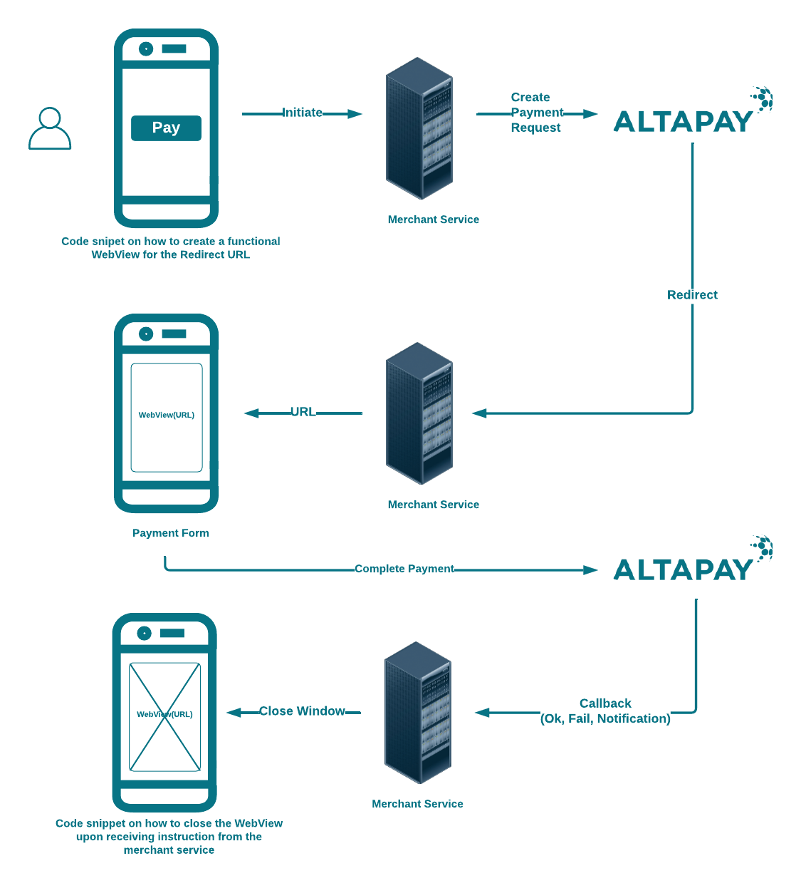

# AltaPay iOS App

The project contains a set of examples of how to display our payment page in an iOS native app

## Usage 

 - Implement the required dependencies
 - Use `createPaymentRequest()` function in `CreatpaymentApiViewController` to call the Api.
 - Define Api method in `PaymentRequestManager` class.
 - To open a webView Create an instance of `WebURLHandler` class. 
 - To close the webView, handle the `WKNavigationDelegate` method in the `WebURLHandler` class.

    
 
## Requirements

  The app requires following libraries/Pods to be installed:

  - pod `Alamofire`
  - pod `SwiftyJSON`

## Changelog

See [Changelog](CHANGELOG.md) for all the release notes.

## License

Distributed under the MIT License. See [LICENSE](LICENSE) for more information.