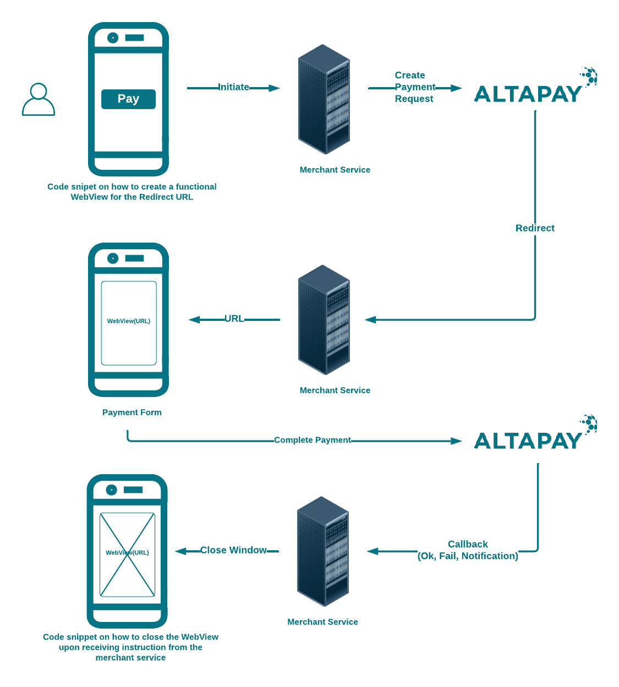
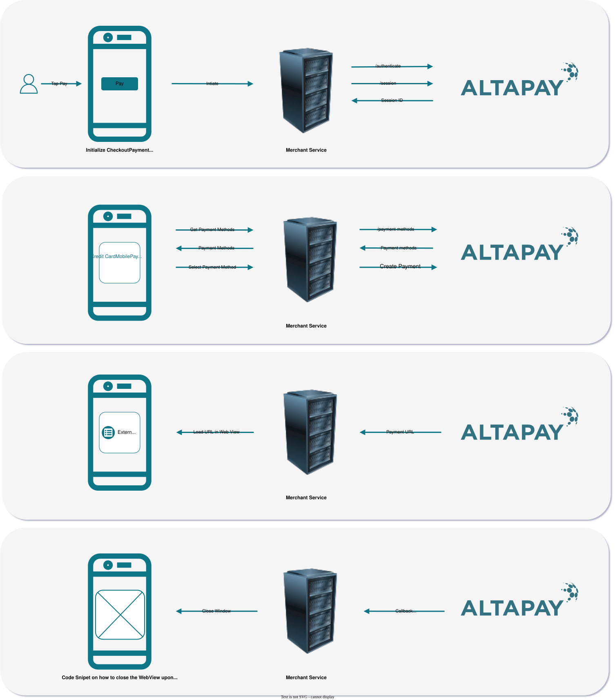

# AltaPay iOS App

The project contains a set of examples of how to display our payment page in an iOS native app

## Merchant API
 
### Requirements

  The app requires following libraries/Pods to be installed:

  - pod `Alamofire`
  - pod `SwiftyJSON`

### Usage
 - Implement the required dependencies
 - Use `createPaymentRequest()` function in `CreatpaymentApiViewController` to call the Api.
 - Define Api method in `PaymentRequestManager` class.
 - To open a webView Create an instance of `WebURLHandler` class. 
 - To close the webView, handle the `WKNavigationDelegate` method in the `WebURLHandler` class.

    


## Checkout API

### Requirements

- iOS 16.0 or later
- Swift 5.9 or later
- Xcode 16.0 or later
- Valid PaymentSDK API credentials (username and password)
- Network access (HTTPS)

#### Swift Package Manager

Add the following to your `Package.swift` file or add the git url to Xcode dependencies

```swift
dependencies: [
    .package(url: "https://github.com/AltaPay/ios-payment-app.git")
]
```

Or add it through Xcode:
1. File → Add Packages...
2. Enter the repository URL
3. Select the version or branch

#### As an Added Framework

1. Clone this repository
2. Add `PaymentSDK` to your Xcode project

### 1. Initialize the SDK

In your app's initialization (e.g., `App` struct or `AppDelegate`):

```swift
// import the SDK
import PaymentSDK

/// Initialize the payment client with credentials.
/// - Parameters:
///   - username: API username
///   - password: API password
///   - baseURL: Base URL for the payment gateway (e.g., "https://testgateway.altapaysecure.com/")
/// public init(username: String, password: String, baseURL: URL)

let client = PaymentClient(
    username: username,
    password: password,
    baseURL: baseURL
)
```

### 2. Create a Payment Session
Use the initalized client to create a session, the sessionID is used to show available payment methods

```swift
/// Creates a new checkout session.
/// - Parameters:
///   - order: Order details including items, customer, and amount
///   - callbacks: Callbacks details including redirect, success, and failure...
///   - configuration: Payment configuration (type, country, language, etc.)
/// - Returns: Checkout session response containing session ID
/// - Throws: `PaymentSDKError` if the operation fails
/// public func startCheckout(order: Order, callBacks: Callbacks, configuration: Configuration) async throws -> CheckoutSessionResponse

let order = Order(
    orderId: "OrderID-\(UUID().uuidString)",
    amount: .init(value: 2.0, currency: "DKK"),
    orderLines: [
        .init(itemId: "123981239", description: "Chaos Emerald", quantity: 1, unitPrice: 1),
        .init(itemId: "123981240", description: "Delivery", quantity: 1, unitPrice: 1)
    ],
    customer: Customer(
        firstName: "John",
        lastName: "Doe",
        email: "test@example.com",
        billingAddress: .init(
            street: "Nygaardsvej 42",
            city: "Copenhagen",
            country: "DK",
            zipCode: "1040"
        ),
        shippingAddress: .init(
            street: "Nygaardsvej 42",
            city: "Copenhagen",
            country: "DK",
            zipCode: "1040"
        )
    ),
    transactionInfo: [
        "additionalProp1": "Additional Payment information test 1",
        "additionalProp2": "Additional Payment information test 2",
        "additionalProp3": "Additional Payment information test 3"
    ]
)

let config = Configuration(
    paymentType: "PAYMENT",
    autoCapture: false,
    country: "DK",
    language: "da"
)

let callBackSuccess = Callback(type: "URL", value: "https://example.com")
let callBackFailure = Callback(type: "URL", value: "https://example.com")

let callbacks = Callbacks(
    success: callBackSuccess,
    failure: callBackFailure,
    redirect: "https://example.com",
    notification: "https://example.com",
    bodyFormat: "JSON" // Accepted values: XML (default), JSON
)

let response = try await client.startCheckout(
    order: order,
    callBacks: callbacks,
    configuration: config
)
let sessionId = response.sessionId
```

### 3. Fetch Payment Methods
Display fetched payment options for user to select

```swift
/// Fetches available payment methods for a checkout session.
/// - Parameter sessionId: The session ID from `startCheckout`
/// - Returns: Array of available payment methods
/// - Throws: `PaymentSDKError` if the operation fails
/// public func getPaymentMethods(sessionId: String) async throws -> [PaymentMethod]

let paymentMethods = try await client.getPaymentMethods(sessionId: sessionId)
```

### 4. Execute Payment
Upon the user clicking the **Pay** button after selecting a payment method, the execution flow depends on the selected method.

#### General Payment Methods
1.  **Initiate via SDK**: Use the SDK to initiate the payment and obtain the redirect URL.
    ```swift
    /// Initiates payment with the selected payment method.
    /// - Parameters:
    ///   - methodId: ID of the selected payment method
    ///   - sessionId: The session ID from `startCheckout`
    /// - Returns: Redirect URL for payment processing
    /// - Throws: `PaymentSDKError` if the operation fails
    /// public func initiatePayment(methodId: String, sessionId: String) async throws -> URL

    let redirectURL = try await client.initiatePayment(methodId: paymentMethod.id, sessionId: sessionId)
    ```
2.  **Display WebView**: Initialize a native `WKWebView` and load the returned `redirectURL`.

#### Apple Pay Handling
If the selected method is Apple Pay, the flow is handled via a merchant-controlled web page:
1.  **Initialize a `WKWebView`**: Create a native webview to handle the payment flow.
2.  **Load Merchant URL**: The WebView should load a specific URL controlled by the merchant.
3.  **Render and Bind**: The merchant page must render the Apple Pay button and bind the next action to it using our [Javascript SDK](https://documentation.altapay.com/v2/Checkout-API/Integration/#js-sdk).

    **Javascript Integration (Merchant Page)**
    ```javascript
    // Initialize AltaPay with the session token and ID
    const session = AltaPay.initiate(token, sessionId);

    // Bind this to the Apple Pay button click
    session.initiatePayment(paymentMethodId);
    ```

### 5. Apple Pay Native Integration
Alternatively, you can integrate Apple Pay natively within your app. Refer to the [Payment Flow Initialization](https://documentation.altapay.com/v2/Checkout-API/Integration/#payment-flow-initialization) for the underlying API details.

1.  **POST Session**: Create a payment session via the SDK.
2.  **GET session/{sessionId}/payment-methods**: Fetch available payment methods and identify Apple Pay.
3.  **Use Apple Pay Meta Data**: Use the provided Apple Pay metadata to interact directly with the Apple Pay framework in your native Swift code.
4.  **Process Payment**: Once the Apple Pay authorization is successful, call the native initiate endpoint to finalize the payment:
    *   **POST** `/payment/{paymentId}/authorization`

    When initialising the payment please call

    *   **POST** `/payment` to let us know that customer started a payment
example of the curl to be done
    ```
    curl --location --request POST 'https://{checkout-api-url}.altapaysecure.com/checkout/v1/api/payment' \
    --header 'Authorization: Bearer $TOKEN' \
    --header 'Content-Type: application/json' \
    --data '{
        "paymentMethodId" : "7ab4889b-6b91-4a56-ba10-efc97026e5e6",
        "sessionId": "2171b42e-dc4e-4a56-9fca-7de6f6d60625",
        "requestData": {
            "applePayRequestData": {
                "source": "PASSKIT"
            }
        }
    }'
    ```


### Models

- `Order` - Order details
- `Amount` - Monetary amount
- `OrderLine` - Order line item
- `Customer` - Customer information
- `Address` - Address information
- `PaymentMethod` - Payment method information
- `PaymentConfiguration` - Payment configuration
- `CheckoutSession` - Checkout session response

## Demo App

A complete demo app is included in the `PaymentApp` directory. To run it:

1. Update credentials in `PaymentApp/App/DemoApp.swift`
2. Build and run the demo app target

## Changelog

See [Changelog](CHANGELOG.md) for all the release notes.

## License

Distributed under the MIT License. See [LICENSE](LICENSE) for more information.